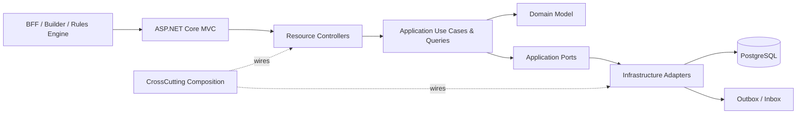

<div align="center">

# D&D Compendium Service

**A versioned, canonical rules catalog for D&D applications.**

It gives BFFs, character builders, and rules engines a structured source of
truth for rules, classes, features, equipment, translations, and mechanical
queries—without coupling those consumers to persistence or import details.

[](https://github.com/igorsobralcc/dnd-compendium-service/actions/workflows/quality.yml)


[Explore the architecture](docs/architecture.md) ·
[Read the ADR](docs/adr/0001-pragmatic-hexagonal-architecture.md) ·
[Review contract versioning](docs/http-contract-versioning.md)

</div>

## What it solves

Rule-heavy products need more than a loose collection of JSON documents. They
need stable identities, source/version lineage, domain validation, localization,
mechanical relationships, and observable changes. This service centralizes
those responsibilities in a relational, version-aware bounded context.

The Compendium deliberately does **not** create characters, calculate final
character sheets, or decide whether a build is complete. It publishes the
canonical rule data those workflows consume.

## API at a glance

Run the service in Development and open the interactive API documentation:

**[http://localhost:5235/swagger](http://localhost:5235/swagger)**

Verify the service from a terminal:

```bash
curl http://localhost:5235/
```

```json
{
  "service": "dnd-compendium-service",
  "status": "running"
}
```

Representative workflows:

```text
POST /api/compendium/source-versions/{sourceVersionId}/imports
POST /api/compendium/source-versions/{sourceVersionId}/validation
GET  /api/compendium/source-versions/{sourceVersionId}/validation/issues

GET  /internal/compendium/character-creation-options
GET  /internal/compendium/entities/{entityType}/{entityId}/mechanics
GET  /internal/compendium/changes
```

There is currently no public hosted demo. Swagger is available locally only in
the `Development` environment.

## Key features

- **Versioned source catalog** — Organize rulesets, rule sources, and source
  versions while preserving provenance and current-version semantics.
- **Typed rule modeling** — Manage abilities, skills, languages, proficiencies,
  classes, subclasses, features, choices, prerequisites, and equipment through
  domain entities and value objects.
- **Controlled imports** — Import typed seed manifests transactionally,
  validate references and invariants, and safely retry an already-imported
  source version without duplicating data.
- **Localized content** — Store field-level translations and query localized
  resources with fallback locale support.
- **Mechanical query APIs** — Supply character-creation options, detailed
  mechanics, and a paginated revision feed to trusted internal consumers.
- **Reliable integration events** — Use transactional Outbox delivery and an
  idempotent Inbox for at-least-once messaging workflows.
- **Explicit access boundaries** — Protect administrative writes and internal
  reads with API-key policies while leaving public catalog reads anonymous.
- **Operational visibility** — Expose liveness, readiness, Prometheus metrics,
  correlation IDs, structured latency, and OpenTelemetry instrumentation.
- **Contract and architecture safety** — Lock the HTTP/OpenAPI surface and fail
  CI when DDD, Hexagonal Architecture, or MVC boundaries regress.

## Architecture

ASP.NET Core MVC acts as the Front Controller. Controllers are inbound adapters
that orchestrate Application use cases; Application ports are implemented by
Infrastructure adapters; Domain remains framework-independent.



Dependency direction:

```text
Compendium.API ───────────────> Compendium.Application ──> Compendium.Domain
       │                                  ▲
       └──> Compendium.CrossCutting ──────┤
                         │                │
                         └──> Compendium.Infra ──────────> Compendium.Domain
```

Application routes use MVC controllers exclusively. Framework-owned health and
Prometheus mappings remain technical host endpoints; they are not permission to
introduce application Minimal APIs.

### Tech stack

| Area | Technologies |
| --- | --- |
| Runtime | .NET 10, C# 14, ASP.NET Core MVC |
| Domain/application | DDD, Hexagonal Architecture, explicit use cases and ports |
| Persistence | PostgreSQL 17, EF Core 10, Npgsql, relational rule modeling |
| API contracts | OpenAPI, Swagger UI, Problem Details, API-key authorization |
| Messaging | Transactional Outbox, idempotent Inbox, hosted dispatcher |
| Observability | OpenTelemetry, Prometheus, structured logging, correlation IDs |
| Quality | xUnit, contract tests, integration tests, architecture tests, Coverlet |
| Delivery | Docker BuildKit, non-root Ubuntu runtime image, GitHub Actions |

For controller ownership, dependency rules, and the end-to-end contribution
checklist, read the full [architecture guide](docs/architecture.md).

## Engineering decisions and lessons learned

### Why MVC instead of application Minimal APIs?

The original endpoint surface distributed routing, authorization, and HTTP
conversion across many handlers. MVC provides one Front Controller pipeline,
discoverable authorization metadata, consistent model binding, and one
controller per entity or query resource. Architecture tests now prevent the old
registration style from returning.

### Why pragmatic Hexagonal Architecture?

The goal is replaceable boundaries, not abstraction for its own sake. Domain
has no framework references; Application owns use cases and ports;
Infrastructure implements those ports; API stays an inbound adapter. Generic
controller hierarchies and mediator layers were intentionally avoided because
they did not solve an active boundary problem.

### Hard problem: preserving contracts during the refactor

Moving the complete HTTP surface from Minimal APIs to MVC risked changing route
templates, operation IDs, authorization, status codes, and JSON behavior. A
locked route matrix, OpenAPI comparison, resource-specific contract tests, and
shared `ApplicationResult` → Problem Details conversion allowed the migration
to remain externally compatible.

### Hard problem: reliable imports and integration events

An import can validate many related entities and must never publish an event for
data that did not commit. Imports therefore validate before persistence and
write Outbox records in the same transaction. Consumers use Inbox records to
make repeated at-least-once deliveries harmless.

### Key takeaways

- Architecture rules are most valuable when executable in CI.
- Relational mechanical rules are easier to query and validate than opaque JSON.
- Resource ownership should follow the aggregate being modified.
- Technical observability and authorization are pipeline concerns; domain
  decisions are not.
- Compatibility needs explicit tests whenever routing technology changes.

The rationale and trade-offs are recorded in
[ADR 0001](docs/adr/0001-pragmatic-hexagonal-architecture.md).

## Local setup

### Prerequisites

- [.NET 10 SDK](https://dotnet.microsoft.com/download/dotnet/10.0)
- PostgreSQL 17 reachable on `localhost:5432`
- Git
- Optional: Docker with BuildKit for the container workflow

The default development database settings are:

```text
Host=localhost;Port=5432;Database=compendium;Username=compendium;Password=compendium
```

Create that database/user locally or override the connection string.

### 1. Clone and restore

```powershell
git clone https://github.com/igorsobralcc/dnd-compendium-service.git
Set-Location dnd-compendium-service
dotnet tool restore
dotnet restore dnd-compendium-service.slnx
```

### 2. Configure local secrets

PowerShell:

```powershell
$env:ConnectionStrings__CompendiumDb="Host=localhost;Port=5432;Database=compendium;Username=compendium;Password=compendium"
$env:Compendium__Security__AdministrativeApiKey="local-admin-key"
$env:Compendium__Security__InternalServiceApiKey="local-service-key"
```

Bash:

```bash
export ConnectionStrings__CompendiumDb='Host=localhost;Port=5432;Database=compendium;Username=compendium;Password=compendium'
export Compendium__Security__AdministrativeApiKey='local-admin-key'
export Compendium__Security__InternalServiceApiKey='local-service-key'
```

Never commit real keys or pass secrets as Docker build arguments.

### 3. Apply migrations

```powershell
dotnet ef database update `
  --project src/Compendium.Infra/Compendium.Infra.csproj `
  --startup-project src/Compendium.API/Compendium.API.csproj
```

### 4. Run the API

```powershell
dotnet run --project src/Compendium.API/Compendium.API.csproj
```

Local endpoints:

| Endpoint | Purpose | Authentication |
| --- | --- | --- |
| `http://localhost:5235/swagger` | Interactive API documentation | Development only |
| `GET /health` | Liveness | Anonymous |
| `GET /health/ready` | Readiness | Anonymous |
| `GET /metrics` | Prometheus metrics | Anonymous |
| `GET /api/compendium/**` | Public catalog reads | Anonymous |
| Non-GET `/api/compendium/**` | Administrative commands | Admin API key |
| `GET /internal/compendium/metadata` | Service metadata | Anonymous |
| Other `GET /internal/compendium/**` | Internal query contracts | Internal or admin API key |

Authenticated example:

```bash
curl \
  --header 'X-API-Key: local-service-key' \
  'http://localhost:5235/internal/compendium/changes?page=1&page_size=50'
```

Missing or invalid credentials return `401`; authenticated callers without the
required permission receive `403`. Both responses use
`application/problem+json`.

## Build and test

```powershell
dotnet build dnd-compendium-service.slnx --no-restore
dotnet test dnd-compendium-service.slnx --no-build
```

Run architecture rules independently:

```powershell
dotnet test `
  tests/Compendium.ArchitectureTests/Compendium.ArchitectureTests.csproj `
  --no-build
```

Check that the EF model still matches the latest migration:

```powershell
dotnet ef migrations has-pending-model-changes `
  --project src/Compendium.Infra/Compendium.Infra.csproj `
  --startup-project src/Compendium.API/Compendium.API.csproj `
  --no-build
```

Enforce Domain line coverage locally:

```powershell
dotnet test tests/Compendium.UnitTests/Compendium.UnitTests.csproj `
  /p:CollectCoverage=true `
  /p:CoverletOutputFormat=cobertura `
  '/p:Include=[Compendium.Domain]*' `
  /p:Threshold=50 `
  /p:ThresholdType=line `
  /p:ThresholdStat=total
```

The solution contains unit, integration, contract, and architecture test suites.
CI runs them against PostgreSQL 17 on every pull request and push to `main`.

## Docker

Build the non-root Linux image:

```powershell
docker buildx build `
  --platform linux/amd64 `
  --tag dnd-compendium-service:local `
  --load `
  .
```

Run it against an existing PostgreSQL instance:

```powershell
docker run --rm `
  --name dnd-compendium-service `
  --publish 5235:8080 `
  --env "ConnectionStrings__CompendiumDb=<connection-string>" `
  --env "Compendium__Security__AdministrativeApiKey=<admin-secret>" `
  --env "Compendium__Security__InternalServiceApiKey=<service-secret>" `
  dnd-compendium-service:local
```

The production image listens on port `8080`, runs as the non-root `app` user,
and health-checks `/health`. It does not apply migrations at startup and does
not enable Swagger by default.

See [Dockerfile guidelines](docs/dockerfile-guidelines.md) for the repository’s
image and secret-handling conventions.

## Documentation

- [Architecture guide](docs/architecture.md) — dependency diagram, request
  flow, controller rules, and contribution checklist.
- [ADR 0001](docs/adr/0001-pragmatic-hexagonal-architecture.md) — rationale and
  consequences of pragmatic Hexagonal Architecture with MVC.
- [HTTP contract versioning](docs/http-contract-versioning.md) — compatibility
  and internal DTO evolution policy.
- [Dockerfile guidelines](docs/dockerfile-guidelines.md) — secure and repeatable
  image conventions.

## Scope boundaries

This repository owns canonical compendium data and its publication. Character
creation workflows, final-sheet calculations, and gameplay rulings belong to
their own bounded contexts and should consume this service through its public
or internal contracts.
