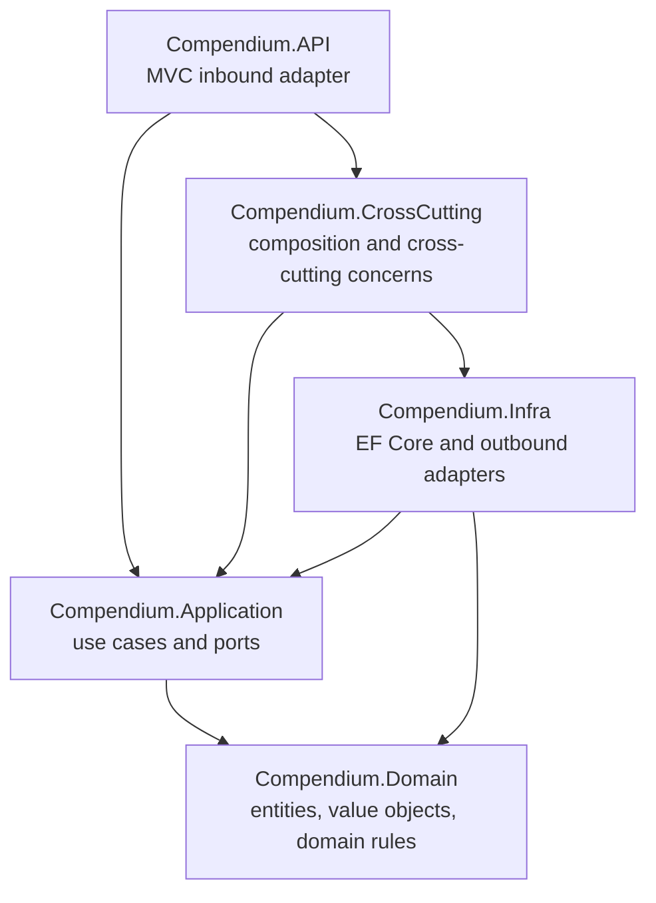
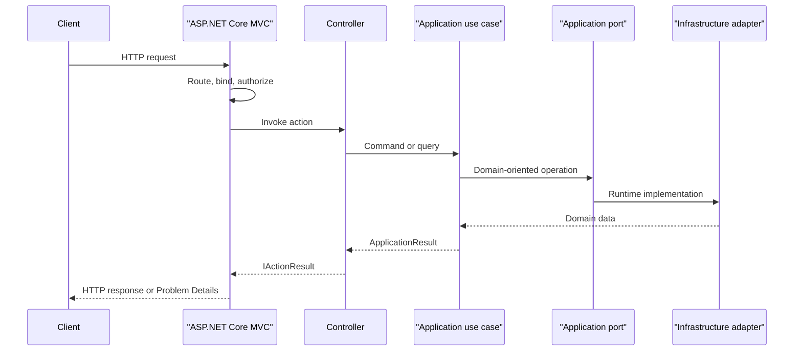

# Architecture guide

The service uses ASP.NET Core MVC as its Front Controller and applies pragmatic
Hexagonal Architecture around a DDD-oriented Domain and Application core. The
automated rules live in
`tests/Compendium.ArchitectureTests`; this document explains the design those
tests protect.

## Dependency direction



The dependency rules are:

- `Compendium.Domain` has no project or external framework dependencies.
- `Compendium.Application` references only `Compendium.Domain`. It owns use
  cases and ports and does not use ASP.NET Core, Entity Framework Core, or DI.
- `Compendium.Infra` implements Application ports. It owns EF Core mappings,
  repositories, migrations, and other outbound adapters.
- `Compendium.API` is the inbound HTTP adapter. Controllers depend on
  Application use cases and queries, never on `CompendiumDbContext`,
  repositories, migrations, or Infrastructure types.
- `Compendium.CrossCutting` is the composition boundary. It wires Application
  ports to Infrastructure adapters and owns authentication, observability, and
  the shared HTTP pipeline.

See [ADR 0001](adr/0001-pragmatic-hexagonal-architecture.md) for the decision
and trade-offs.

## MVC Front Controller

ASP.NET Core routing, model binding, filters, authorization metadata, and
Problem Details form the Front Controller. `Program.cs` builds the host,
applies the shared pipeline, calls `MapControllers`, and maps only technical
framework endpoints.

Application HTTP routes must be controller actions. Do not add `MapGet`,
`MapPost`, `MapPut`, `MapDelete`, `MapPatch`, or `MapGroup` handlers for
application behavior.

Framework-owned endpoints such as health checks and Prometheus scraping remain
mapped through their framework extensions. This exception does not authorize
application Minimal APIs: `/health`, `/health/ready`, and `/metrics` expose
technical host concerns rather than domain resources.

## Controller ownership

Each entity or query resource has exactly one HTTP controller. Controllers are
named after that resource, end in `Controller`, derive from
`CompendiumControllerBase`, and remain orchestration-only.

Subresource operations belong to the aggregate they modify. For example,
attaching a weapon property belongs to `WeaponsController`; it changes a
`Weapon`, even though it refers to a `WeaponProperty`.

Use these conventions:

- Define the stable route template and operation name with MVC attributes.
- Apply `[AdministrativeWrite]` to administrative mutations.
- Apply `[InternalRead]` at controller level for internal query resources.
- Delegate business rules to an Application use case or query.
- Convert `ApplicationResult` through `CompendiumControllerBase` so success
  statuses and Problem Details remain consistent.
- Keep request DTOs beside the controller when they are specific to its HTTP
  contract. Share a DTO only when the represented contract is genuinely the
  same.

The locked route and OpenAPI expectations are documented further in
[HTTP contract versioning](http-contract-versioning.md).

## Adding a resource end to end

### Domain

- Add or extend the aggregate, entity, value objects, and domain errors.
- Keep invariants inside Domain behavior rather than controllers or adapters.
- Add focused unit tests for success and failure paths.

### Application use case and port

- Add a command/query contract and a directly named use case.
- Define an outbound port in `Compendium.Application` only when the use case
  needs an external capability.
- Return `ApplicationResult` for expected application failures.
- Avoid framework types, generic base use cases, or an interface that has no
  meaningful boundary.

### Infrastructure adapter

- Implement the Application port in `Compendium.Infra`.
- Preserve tracking and transaction boundaries in repository methods.
- Add EF configuration and a migration only when the persisted model changes.
- Register the port-to-adapter mapping through `Compendium.CrossCutting`.

### MVC controller

- Create one controller for the entity or resource.
- Inject only Application use cases or queries.
- Preserve route, verb, request, response, status, operation name, and
  authorization metadata.
- Add the route to the contract matrix and cover resource-specific behavior.
- Do not add a Minimal API registration to `Program.cs`.

### Verification

Run the focused tests while developing, then the complete gates:

```powershell
dotnet build dnd-compendium-service.slnx --no-restore
dotnet test tests/Compendium.ArchitectureTests/Compendium.ArchitectureTests.csproj --no-build
dotnet test dnd-compendium-service.slnx --no-build
dotnet ef migrations has-pending-model-changes --project src/Compendium.Infra/Compendium.Infra.csproj --startup-project src/Compendium.API/Compendium.API.csproj --no-build
```

When dependencies have not yet been restored, run `dotnet restore` and
`dotnet tool restore` first.

## Composition and request flow



This flow keeps HTTP and persistence replaceable while allowing the service to
stay direct: controllers orchestrate, use cases coordinate domain behavior,
and adapters handle external technology.
